<div align="center">

# Floorplan

Drag people into teams, rooms, and shared spaces

[![Live][badge-site]][url-site]
[![HTML5][badge-html]][url-html]
[![CSS3][badge-css]][url-css]
[![JavaScript][badge-js]][url-js]
[![Claude Code][badge-claude]][url-claude]
[![License][badge-license]](LICENSE)

[badge-site]:    https://img.shields.io/badge/live_site-0063e5?style=for-the-badge&logo=googlechrome&logoColor=white
[badge-html]:    https://img.shields.io/badge/HTML5-E34F26?style=for-the-badge&logo=html5&logoColor=white
[badge-css]:     https://img.shields.io/badge/CSS3-1572B6?style=for-the-badge&logo=css3&logoColor=white
[badge-js]:      https://img.shields.io/badge/JavaScript-F7DF1E?style=for-the-badge&logo=javascript&logoColor=black
[badge-claude]:  https://img.shields.io/badge/Claude_Code-CC785C?style=for-the-badge&logo=anthropic&logoColor=white
[badge-license]: https://img.shields.io/badge/license-MIT-404040?style=for-the-badge

[url-site]:   https://floorplan.neorgon.com/
[url-html]:   #
[url-css]:    #
[url-js]:     #
[url-claude]: https://claude.ai/code

</div>

---

## Overview

Floorplan builds team maps. Drag people from a roster into groups and sub-groups, split someone across two teams with a percentage, add shared spaces that span several groups (a QA pool, an on-call rotation), and read the result two ways: as a nested-box **diagram**, or as a pixel-art **building** with rooms, doors, corridors and desks you can walk past. The whole document is YAML you can edit in a side panel, with gitlabform-style `profiles:` you define once and `extends:` from any group or person.

**Live:** floorplan.neorgon.com

---

## Features

- **Drag and drop** -- roster to group seats at 100%, group to group moves, Alt-drop splits the time evenly, drop on the roster unassigns. Keyboard carry (Enter to pick up, Enter on a group to seat) for the same moves
- **Percentages that add up** -- every seat has a segmented share bar: drag it in 5% steps, nudge with the arrow keys, or click the `NN%` badge to type; the roster shows each person's total and the Insights drawer flags anyone over or under 100%
- **Groups, sub-groups, shared spaces** -- bands span the groups they name; `capacity` draws vacant desks for open headcount; `owns` renders as plaques
- **Diagram view** -- nested boxes, columns per group, bands as strips across the columns they cover
- **Building view** -- rooms on a 24-column grid, auto-packed or placed with `layout: {x, y, w, h}`; doors where linked rooms touch, corridors where they do not; a person split across two touching rooms sits on the shared wall; drag rooms by the grip, resize from the corner
- **Visit mode** -- walk a pixel avatar through the building with WASD or the arrows; walls block, doors let you through, standing next to a desk shows that person's card
- **Sim mode** -- the office comes alive: everyone walks in, works at their desk, fetches coffee in a shared space, chats with a colleague, holds a team sync, and a split person hops between desks; a clock (live or scrubbed) dims people outside their 09:00 to 17:00 local; click a character, then a colleague to make them talk or the floor to send them there; jump to **Peak** (the fullest hour) or **Play day** to watch the office hand over from zone to zone, with lunch around noon local; energy and company drift while people work and weight what they do next; stir it with a party (confetti in the biggest shared space), a coffee break, an earthquake (everyone out to the yard), an outage (the owning room plus the shared spaces that span it respond), a fire drill, a visitor tour (a guest walks every room, the people there greet them) or a demo day (one person presents, the rest react); drop someone from the roster onto a room and they walk from where they landed to a desk; walk frames come from the shared Avatar Kit
- **YAML with reuse** -- `profiles:` + `extends:` deep-merge (scalars override, members and owns concatenate); anchors and `<<:` merges work too; visual edits regenerate the YAML without flattening `extends`
- **Markdown** -- notes on people, groups and the document; paste a markdown outline (`## Group`, `- Name (50%) @Location`) to import; the Markdown export writes the same syntax back
- **Exports** -- YAML, JSON, Markdown, Mermaid, SVG, PNG (2x), a `#d=` share link that carries the document, and "Copy as prompt for Claude"; `?src=<url>` loads a hosted file
- **Embeddable** -- `?embed=1&mode=building#d=...` in an iframe shows just the board (never touches the visitor's localStorage); `readonly=1` locks it; `fit=1` scales the building to the frame; `sim=1` (or `sim=party`) starts Sim mode in the frame
- **Agent-ready** -- `llms.txt` carries the schema, the rules that trip generated documents, the link recipe, and `schema.json` is the same tree as a JSON Schema
- **Two examples** -- a nested team chart and an office building with explicit layout, bands and links; every name is fictional
- **Avatars and display** -- 16x16 characters from the shared Neorgon Avatar Kit: presets in the person sheet, "Use my character" from your Pixeldoll cookie, paste a `neoav1:` code, or "Design in Pixeldoll"; per-document display options: center seats in a box, shares as bars / badges / hidden, a cat or dog keeping an open seat, pixel or initials, order by name or share, locations on or off
- **Skills and time zones** -- tags on people, needs on groups, a coverage check in Insights; locations or `tz:` feed a core-hours strip per group and a warning when a team shares fewer than three hours
- **Templates, CSV, slides, print** -- start a squad, pod, platform team or shared rotation in one click; paste CSV with a header row; open the map as a Presentation Sage deck; print the board light on paper
- **Versions and diff** -- dated snapshots stored inside the document (`history:`), a scrubber to preview them, restore with undo, and compare now with any snapshot or a pasted document: the board marks joined/moved/left/share changes and the Changes tab lists them
- **Puzzle** -- the reorg game: the map gets scrambled and you put everyone back in the fewest moves, guided by the compare marks and the Changes tab; Hint flashes a wrong seat, Give up restores, best scores stay per document; with Sim on, people walk as you fix it
- **Local only** -- localStorage, no account, no server; 40 steps of undo that survive Clear and example loads

---

## YAML in thirty seconds

```yaml
title: Atlas Program
profiles:
  delivery: { color: "#60a5fa", capacity: 6 }
people:
  - { name: Leon Varga, location: Hungary }
groups:
  - name: Team Kestrel
    extends: delivery
    owns: [Checkout, Payments]
    members: [priya-raman, { person: leon-varga, pct: 50 }]
    groups:
      - { name: Back End, members: [aiko-tanaka] }
bands:
  - { name: QA, spans: [team-kestrel, team-lantern], members: [yusuf-demir] }
links:
  - { from: team-kestrel, to: team-lantern, label: shared backlog }
```

The full schema, the link contract, embedding and the import formats are in [`llms.txt`](llms.txt); [`schema.json`](schema.json) is the JSON Schema. The two bundled documents live in [`examples/`](examples/).

## Embed it

```html
<iframe src="https://floorplan.neorgon.com/?embed=1&mode=building#d=PAYLOAD" width="100%" height="640" style="border:0" title="Team map"></iframe>
```

Get `PAYLOAD` from **Export → Copy share link** (everything after `#d=`), or point `?src=` at a hosted YAML file instead of using the hash.

---

## Running locally

ES modules require an HTTP server (not `file://`):

```bash
make serve
```

Or manually:

```bash
python3 -m http.server 8868
```

The only dependency is js-yaml 4.1.0 from a CDN, pinned with SRI; everything else is plain ES modules.

---

## Architecture



```
floorplan-site/
├── index.html              # HTML shell: header kit, roster, board, YAML panel, drawers, dialogs
├── llms.txt                # schema, link contract, embedding, generation recipe for agents
├── schema.json             # the document tree as a JSON Schema
├── examples/               # the two bundled documents as files (?src= and llms.txt point here)
├── css/
│   ├── style.css           # app shell, roster, seats, panels, sheets, drawer
│   ├── diagram.css         # nested-box view
│   ├── building.css        # pixel office: rooms, walls, doors, corridors, desks, visitor
│   └── sim.css             # Sim mode: actors, bubbles, events, the bar
├── js/
│   ├── app.js              # entry point: URL, saved session or example, then render
│   ├── state.js            # model, mutations, localStorage, undo/redo
│   ├── schema.js           # normalize YAML/JSON -> model, profiles/extends, emit tree
│   ├── yaml.js             # js-yaml in/out with the alias-identity clone
│   ├── allocation.js       # totals, FTE, capacity, insights
│   ├── timezones.js        # zone from tz/location, core-hours overlap
│   ├── templates.js        # group shapes: squad, pod, platform, shared bands
│   ├── diff.js             # diff two documents, marks for the board overlay
│   ├── versions.js         # snapshots: take, preview, restore, compare
│   ├── layout.js           # building packer: rects, bands, doors, corridors, straddles
│   ├── render.js           # shell renderer + YAML panel + insights + detail sheet
│   ├── render-diagram.js   # diagram view
│   ├── render-building.js  # building view
│   ├── parts.js            # seat/head markup shared by both views
│   ├── avatar.js           # adapter over js/neorgon-avatar.js (kit): seeded looks, presets, codes, cookie
│   ├── neorgon-avatar.js   # vendored Neorgon Avatar Kit (do not edit; sync-avatar.sh)
│   ├── dnd.js              # pointer drag for people and rooms, keyboard carry
│   ├── events.js           # delegated clicks, keys, YAML apply, menus
│   ├── export.js           # YAML/JSON/Markdown/Mermaid, share link, imports
│   ├── image-export.js     # SVG + PNG from the measured DOM
│   ├── markdown.js         # escape-first renderer, outline import/export
│   ├── visit.js            # walk the office (lazy-loaded)
│   ├── sim.js              # Sim mode: actors, tick, clock, bar, click-to-command (lazy-loaded)
│   ├── sim-brain.js        # routines and events: coffee, chat, sync, party, earthquake, outage
│   ├── path.js             # BFS routes over the building grid
│   ├── puzzle.js           # the reorg puzzle: scramble, compare marks as clues, moves, best (lazy-loaded)
│   └── examples.js         # Example A and B
├── docs/architecture.mmd   # source of the diagram above
├── robots.txt, sitemap.xml, CNAME, Makefile
└── README.md
```

---

<div align="center">
<sub>Part of <a href="https://neorgon.com/">Neorgon</a></sub>
</div>
